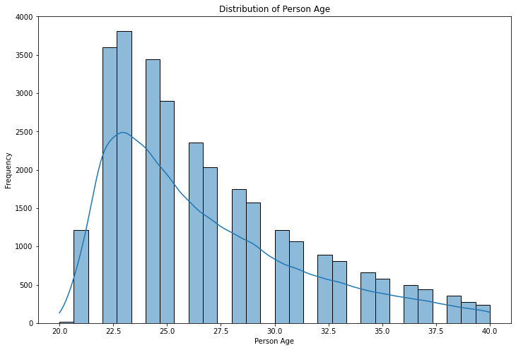
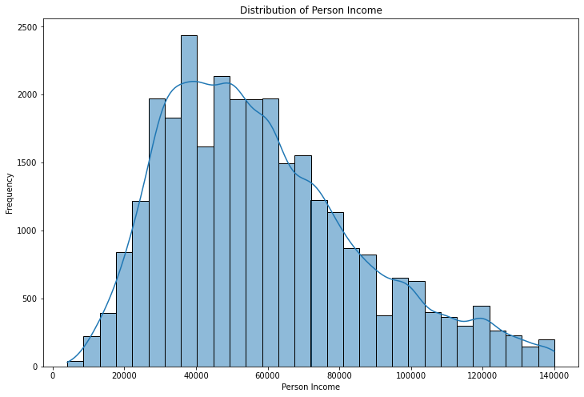
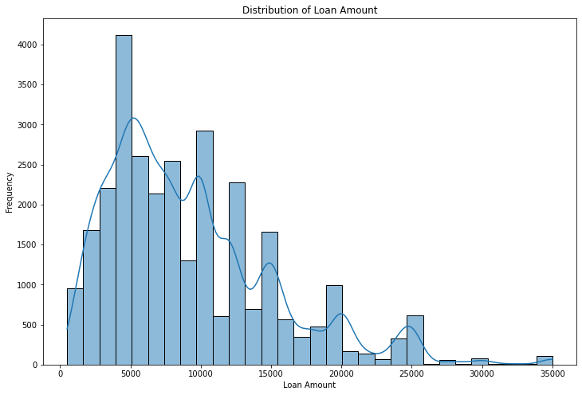
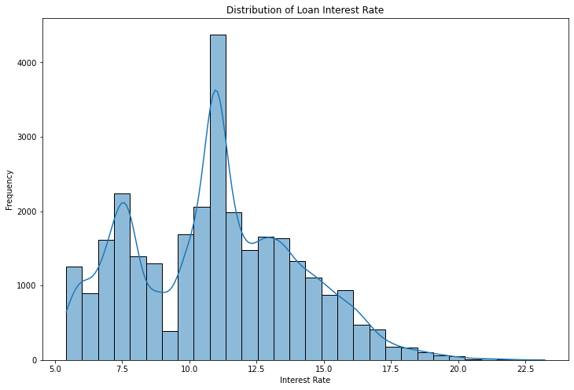
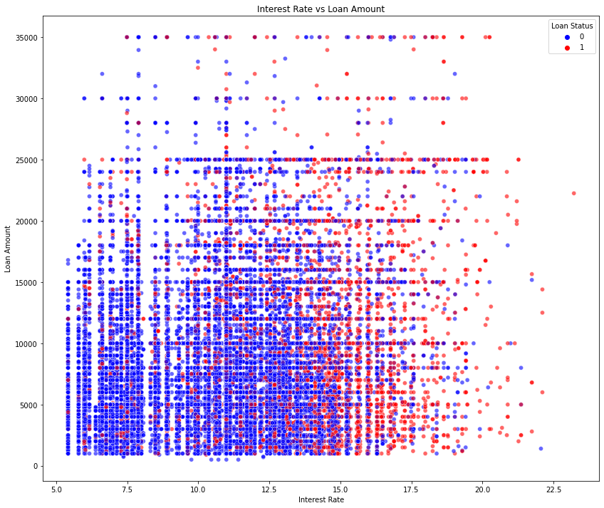
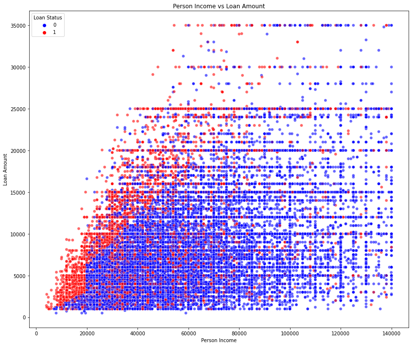
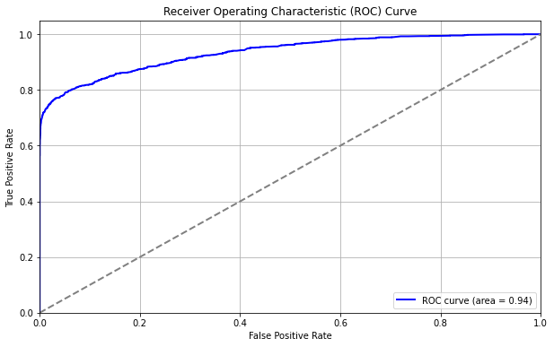
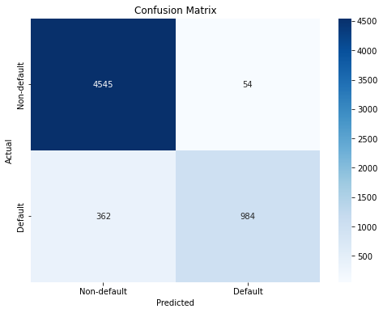

# Credit Risk Modeling for Prediction

## Project Overview

This project aims to develop a statistical model to predict loan defaults based on borrower information. In deployment, the model could help financial institutions assess the risk associated with lending to various applicants, thereby reducing potential financial losses.

## Table of Contents

1. [Dataset Description](#dataset-description)
2. [Data Preprocessing](#data-preprocessing)
3. [Feature Engineering](#feature-engineering)
4. [Model Building](#model-building)
5. [Model Evaluation](#model-evaluation)
6. [Results and Insights](#results-and-insights)
7. [Request Example](#request-example)
8. [Future Work](#future-work)

## Dataset Description

The dataset used in this project is sourced from the [Kaggle](https://www.kaggle.com/datasets/laotse/credit-risk-dataset). It includes features such as age, income, employment length, loan amount, loan interest rate, and others. The target variable is whether the borrower defaulted on the loan.

### Features

- `person_age`: Age of the borrower
- `person_income`: Annual income of the borrower
- `person_emp_length`: Length of employment in years
- `loan_amnt`: Loan amount requested
- `loan_int_rate`: Interest rate on the loan
- `loan_percent_income`: Percentage of income that goes towards loan payments
- `cb_person_cred_hist_length`: Length of credit history in years
- `person_home_ownership`: Home ownership status (OWN, RENT, MORTGAGE, OTHER)
- `loan_intent`: Purpose of the loan (EDUCATION, HOMEIMPROVEMENT, MEDICAL, PERSONAL, VENTURE)

## Data Preprocessing

### Steps Taken

1. **Handling Missing Values**: Missing values were imputed using median or mode values.
2. **Outlier Removal**: Outliers in numerical features were removed using the IQR method.
3. **Encoding Categorical Variables**: Categorical variables were encoded using one-hot encoding.

## Exploratory Data Analysis

### Distribution of Key Variables

The distribution of key variables such as `person_age`, `person_income`, `loan_amnt`, and `loan_int_rate` can provide insights into the characteristics of the borrowers.

#### Distribution of Person Age
We see from the below distribution that borrowers in this dataset tend to be younger. The intuition behind this is that typically older people have built up an amount of wealth that prevents them from needing to borrow.</br>



#### Distribution of Person Income
We also see that majority of the persons income in this dataset fall within $30,000 - $80,000. Note this number is not representative of the population, rather the incomes of people who are taking loans.</br> 



#### Distribution of Loan Amount
Considering the majority of incomes in the dataset, we would expect loan amount distribution to skew left. Indeed, the loans are mostly under $20,000.</br>



#### Distribution of Loan Interest Rate
Without credit scores in the dataset the interest rates on the loans could be useful in gauging applicants, as typically better credit scores are rewarded with relativley lower interest rates. In this case the rates are somewhat evenly distributed, and this feature may be more useful at the individual level.</br>



### Scatter Plots of Variables and Defaults
Scatter plots with default indicators can help us visualize and identify groups who are at higher risk of default

#### Person Income vs Loan Interest Rate (1 = Default)
This chart is a visualization of how high interest and low income is a recipe for disaster. Another interesting takeaway is that high rates trend towards defult for all income levels, which could be an indicator of people with poor credit history (hence the high interest rate) sustaining their habit.</br>  


#### Interest Rate vs Loan Amount
Also confirming the high interest rate-high default rate trend. This chart however does not show any obvious correlation between loan amount and default likelihood.</br> 



#### Person Income vs Loan Amount
This chart seems to point out the obvious but it is slightly jarring to look at. People taking loans that amount to a relativley large portion of their income are almost gaurunted to default. This group is the red diagonal on the left side of the plot.</br>



### Default Rates by Categories

Default rates by categories such as `home_ownership`, `loan_intent`, and `loan_grade` provide insights into which groups are more likely to default.

#### Default Rates by Home Ownership
This chart indicates that a person who does not own their home (or working towards owning it) is more than twice as likely to default on a loan as someone who does. This is unsuprising but another discouraging piece of information for renters who cannot afford to buy a home in the current economy.</br> 


#### Default Rates by Loan Grade
Portraying the obvious here... but it is staggering that over 98% of G grade loan in this data set ended in defaults</br>


#### Default Rates by Loan Intent
Not a ton of trends in this chart, although it is nice to see education with relativley low default rates. This could be due to the longer time to amoratize, or perhaps educated people better understand loans and the dangers of them. What stands out the most is that debt consolidation has the highest default rate... this feels like a bummer. 


## Model Building

Multiple models were built and compared using sklearns modeling and metric packages.
The models tested in this project include: 

- Logistic Regression
- Decision Tree
- Random Forest

Hyperparameter tuning was performed using GridSearchCV to find the best parameters for the random forest model.

## Model Evaluation

Models were evaluated using various metrics:
- **Confusion Matrix**: To visualize the performance in terms of true positives, true negatives, false positives, and false negatives.
- **ROC Curve**: To evaluate the model's ability to distinguish between classes (Default vs Non-Default).
- **AUC Score**: Area under the ROC Curve to quantify the overall performance.

### Model Performance

- **Logistic Regression**: ROC AUC = 0.85
- **Decision Tree**: ROC AUC = 0.87
- **Random Forest**: ROC AUC = 0.94 (Best Performing Model)

## Results and Insights

The Random Forest model showed the best performance with an ROC AUC score of 0.94. Below we summarize the winning model:

### Feature Importances

The feature importances in the Random Forest model show which variables are most predictive of loan default. The most important features are `loan_percent_income`, `person_income`, `loan_int_rate`, and `loan_grade`. These are all intuitivley important, but it is nice to verify that model recognizes this. It is also interesting to note that age and credit length aren't a very big factor in predicting default. This somewhat suggests that being a reckless debtor is inherent, and not something that can be easily learned away. **However, this is a large claim and would take enourmous amounts of social research to support!


### Model Performance Metrics

The performance of the Random Forest model is evaluated using ROC Curve and Confusion Matrix.

#### ROC Curve



#### Confusion Matrix



## Request Example

Below we give the model a (made up) persons loan information, and the model returns an adequate prediction. 

```json
 {
  "person_age": 45,
  "person_income": 55000,
  "person_emp_length": 2,
  "loan_amnt": 15000,
  "loan_int_rate": 11.25,
  "loan_percent_income": 0.170203,
  "cb_person_cred_hist_length": 3,
  "person_home_ownership_OTHER": 0, 
  "person_home_ownership_OWN": 1,
  "person_home_ownership_RENT": 0, 
  "loan_intent_EDUCATION": 1,
  "loan_intent_HOMEIMPROVEMENT": 0, 
  "loan_intent_MEDICAL": 0,
  "loan_intent_PERSONAL": 0, 
  "loan_intent_VENTURE": 0,
  "loan_grade_B": 1,
  "loan_grade_C": 0,
  "loan_grade_D": 0,
  "loan_grade_E": 0,
  "loan_grade_F": 0,
  "loan_grade_G": 0,
  "cb_person_default_on_file_Y": 0
}
```
Response:</br>
Model Default Prediction: 0 (non-default)</br> 
Model Confidence in Prediction: 0.95%

## Future Work
Potential future improvements include:

- Incorporating additional features such as credit score.
- Get way more data and build a neural network:)
- Implementing a more sophisticated handling of missing data.
- Productionize the model into an API and allow public use

## Thanks for reading!!! 
I love the idea of machines assisiting in managing risk, but it is scary to invision them having full decision making responsibilty. Biases can be baked into models in subtle ways and certain groups could get the short end of this stick and be unfairly treated. Hence it is best to always involve human intuition for human decisions. Anyways, I always enjoy working with data like this as it is fun to speculate on and helps me better understand our world one niche topic at a time:)
